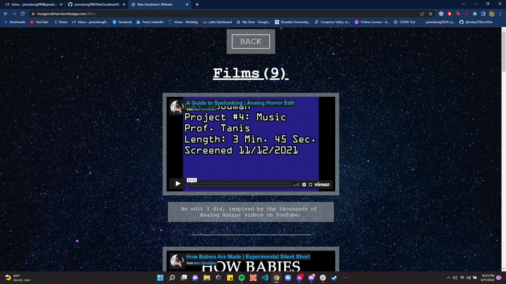
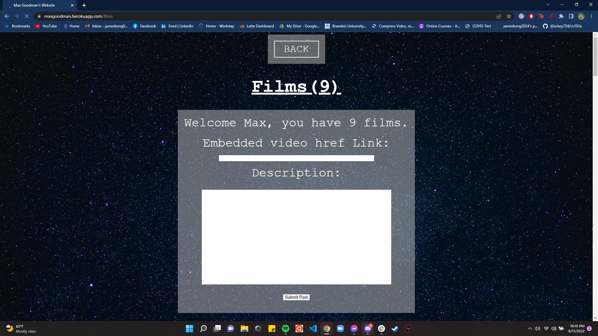
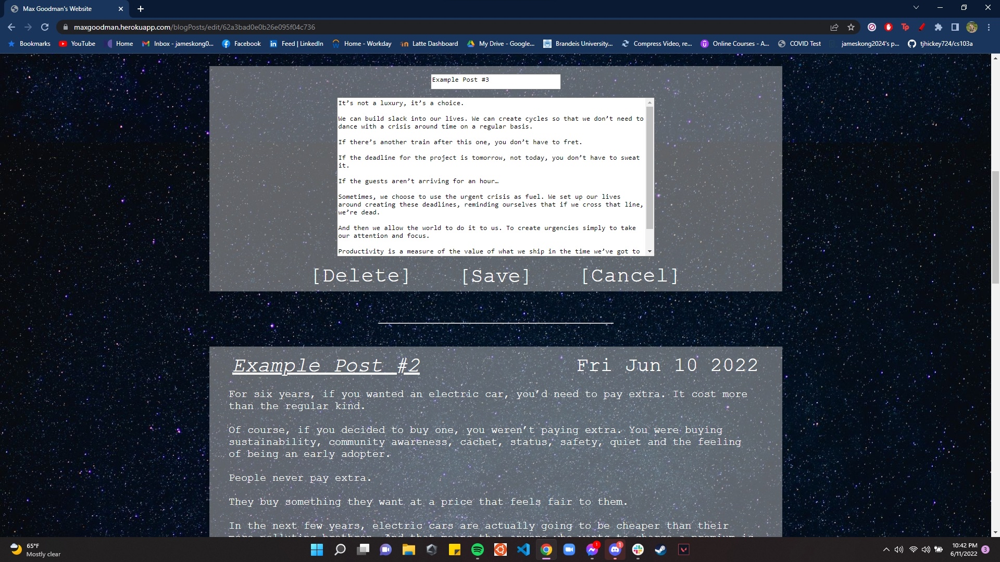
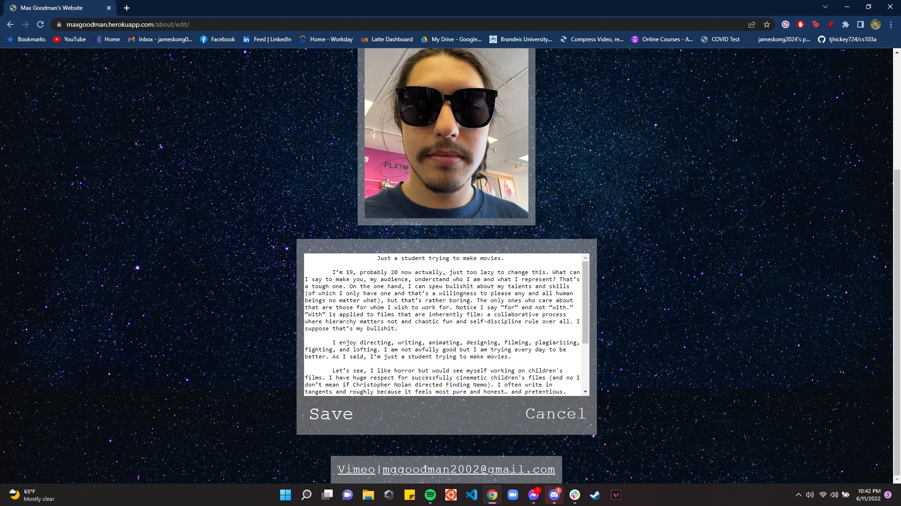
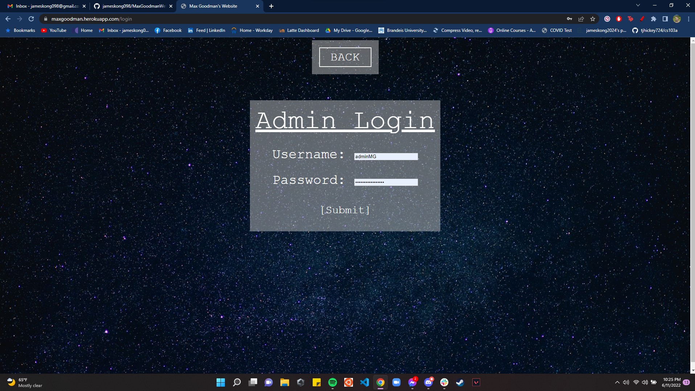

# Max Goodman's Website

This repository contains the source code for a website created for a friend of mine. The website serves as a practice project to enhance my skills in HTML, JavaScript, Express.js, and Node.js. It was also a fun project to create something meaningful for a friend.








## Features

- **Authentication**: Admin account which can log in and add/edit posts.
- **Dynamic Content**: The website uses EJS templates to render dynamic content.
- **Database Integration**: The application connects to a MongoDB database to store and retrieve data.
- **Responsive Design**: The website is designed to be responsive and works well on different screen sizes.

## Live Website

(Website is now down and is no longer in use, but it was hosted on Heroku!)

~~You can view the live website at: [https://maxgoodman.herokuapp.com/index](https://maxgoodman.herokuapp.com/index)~~

### Key Files and Directories

- **app.js**: The main entry point of the application. It sets up the Express server, connects to the MongoDB database, and configures session handling and routing.
- **models/**: Contains Mongoose models for different entities such as `About`, `Animation`, `Film`, `Post`, and `User`.
- **public/**: Contains static files such as images and stylesheets.
  - **stylesheets/style.css**: The main stylesheet for the website.
- **routes/**: Contains route handlers for different parts of the application.
  - **auth.js**: Handles authentication routes such as login, register, and logout.
- **views/**: Contains EJS templates for rendering different pages of the website.
  - **about.ejs**: Template for the "About" page.
  - **aboutDeveloper.ejs**: Template for the "About the Developer" page.
  - **animations.ejs**: Template for the "Animations" page.
  - **blogPosts.ejs**: Template for the "Blog Posts" page.
  - **error.ejs**: Template for the error page.
  - **films.ejs**: Template for the "Films" page.
  - **index.ejs**: Template for the home page.
  - **login.ejs**: Template for the login page.

## Setup and Installation

1. Clone the repository:
    ```sh
    git clone https://github.com/jameskong098/MaxGoodmanWebsite.git
    cd MaxGoodmanWebsite
    ```

2. Install dependencies:
    ```sh
    npm install
    ```

3. Start local mongodb server (optional)
    ```sh
    mongodb
    ```

4. Set up environment variables:
    Create a `.env` file in the root directory and add the following:
    ```env
    mongodb_URI=your_mongodb_uri
    userID=your_user_id
    SECRET=your_secret_key
    ```

5. Run the application:
    ```sh
    npm start
    ```
